# CT18 -- Header Diagrams

Conceptual diagrams referenced from `WeightedGraph.h`.

---

## 1. Weighted Graph
*`WeightedGraph.h` -- edges have numeric costs; enables shortest path and MST algorithms*

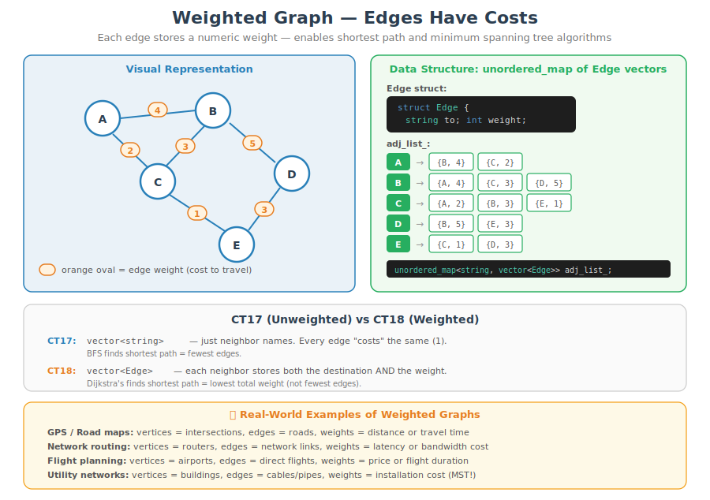

---

## 1b. Weighted Graph -- What Can You Query From Source A?
*What the `WeightedGraph` class alone answers (direct edge costs) vs. what needs an algorithm (multi-hop shortest paths) -- bridges into Dijkstra's*

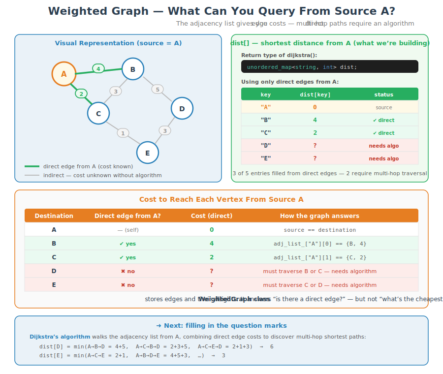

---

## 1c. Multi-Hop Cost From Source A -- The Final Result
*What the answer table actually looks like for a single source -- shows the cheapest route to every vertex (direct or multi-hop), motivating why fewest-edges is not the same as lowest-cost*

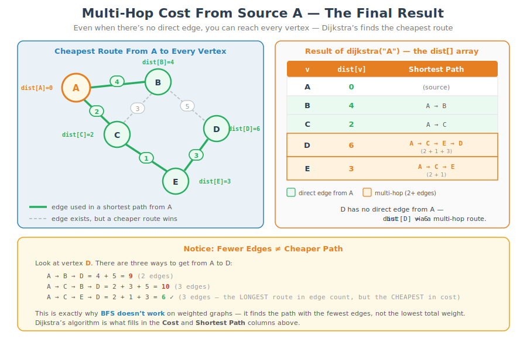

---

## 2. Dijkstra's Algorithm
*`WeightedGraph.h::dijkstra()` -- greedy shortest path using priority queue*

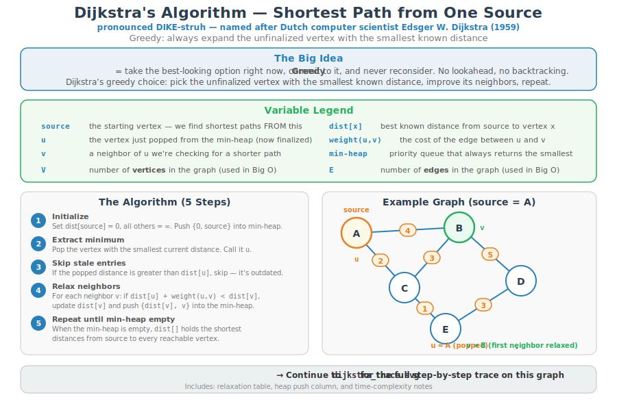

---

## 2b. Dijkstra's Algorithm — Step-by-Step Trace
*Tracing `dijkstra("A")` on the example graph, including the relaxation formula and heap pushes*

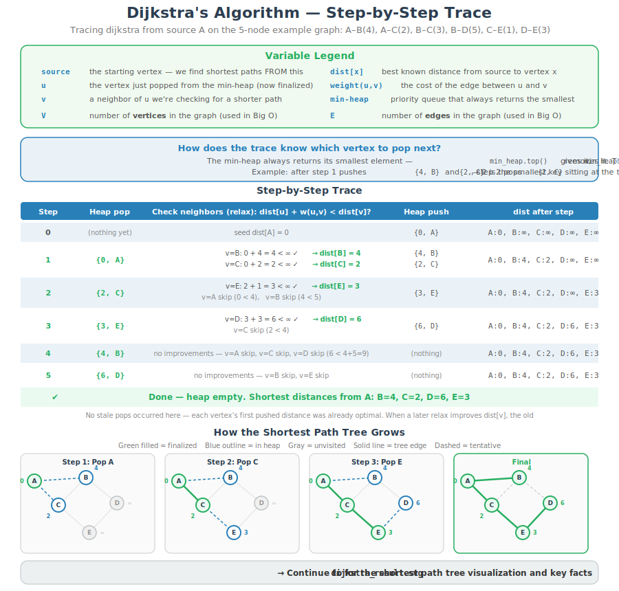

---

## 2c. Dijkstra's Algorithm — Shortest Path Tree Result
*The resulting shortest path tree from A, path reconstructions, and key facts (V−1 edges, negative-weight limitation, greedy property)*

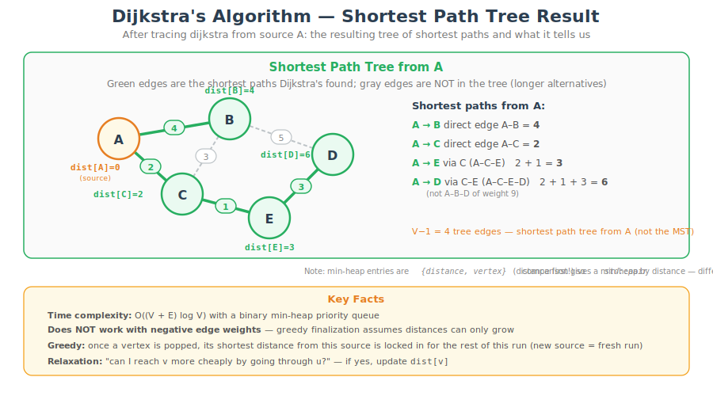

---

## 2d. Dijkstra's vs Prim's — Comparison
*Side-by-side: same graph, same min-heap approach, different questions — shortest paths vs minimum spanning tree*

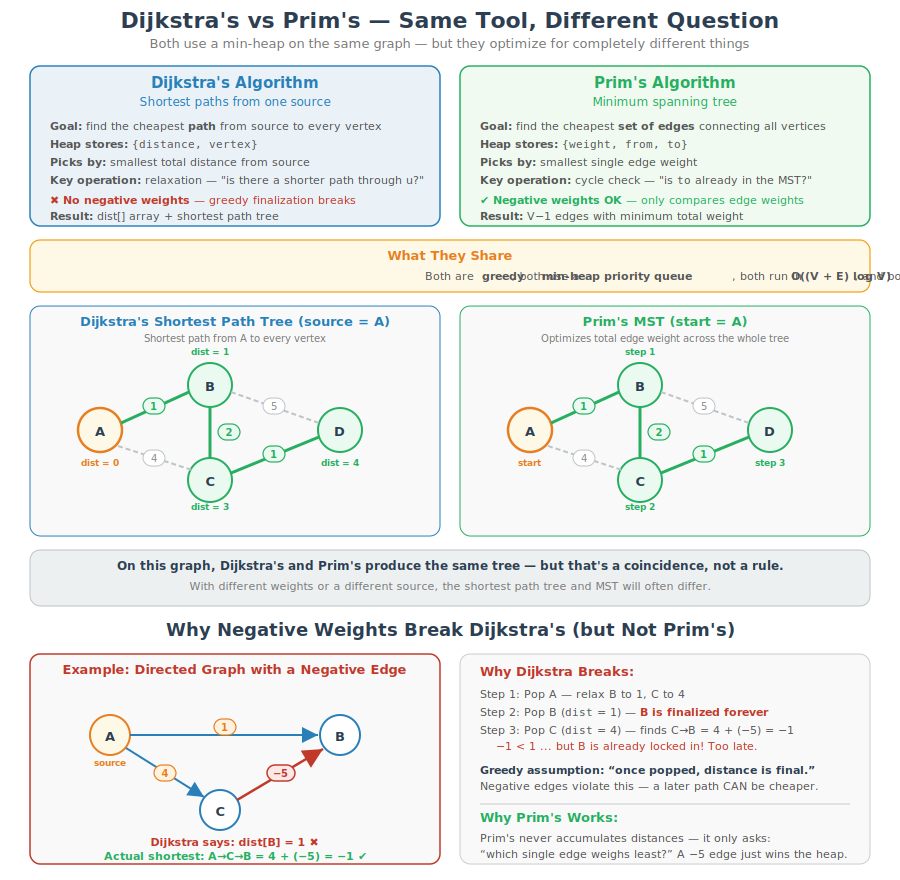

---

## 2e. Dijkstra's vs Prim's — Different Trees Example
*A graph where Dijkstra's and Prim's produce different trees — Dijkstra must use the expensive A—B(10) direct edge, but Prim's skips it for the cheap D—B(1)*

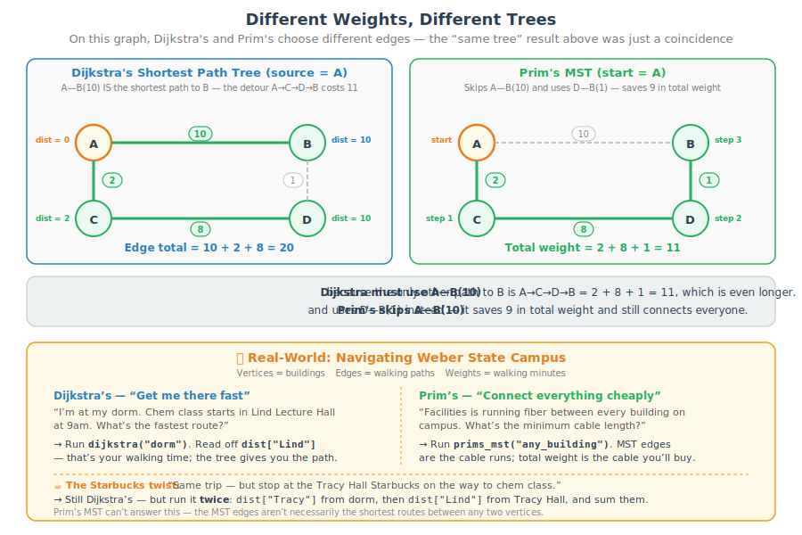

---

## 3. Prim's MST
*`WeightedGraph.h::prims_mst()` -- grow the cheapest spanning tree one edge at a time*

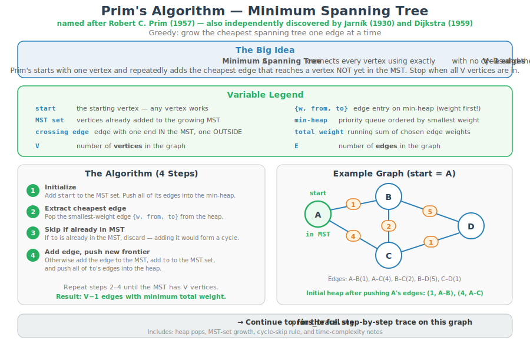

---

## 3b. Prim's MST — Step-by-Step Trace
*Tracing `prims_mst("A")` on the example graph, including heap pops, MST-set growth, and the cycle-skip rule*

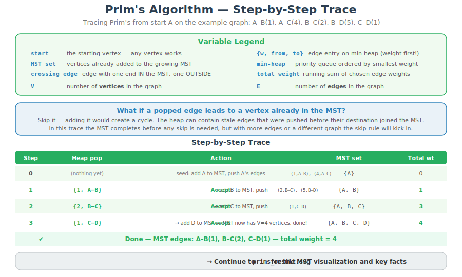

---

## 3c. Prim's MST — MST Result
*The resulting minimum spanning tree from A, edge list with total weight, excluded edges, and key facts (cut property, negative weights OK)*

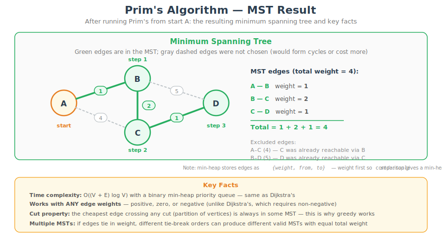
